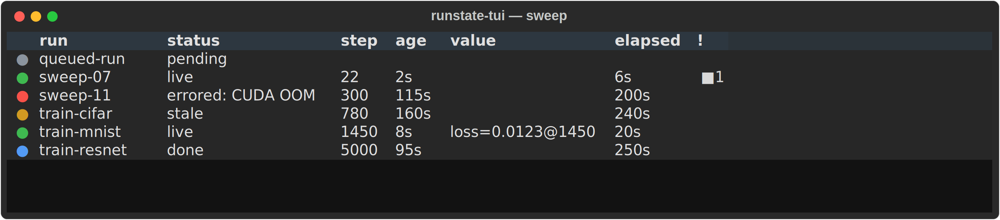
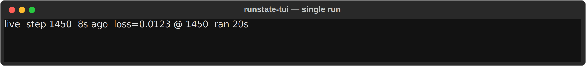
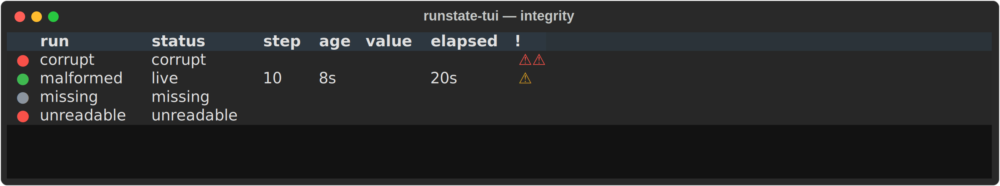
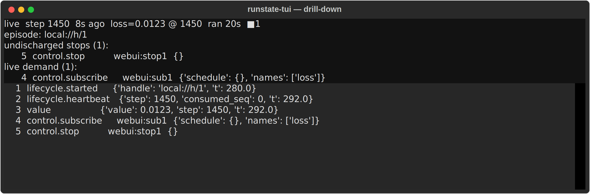
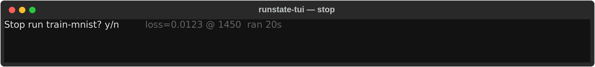

# runstate-tui

A **control-plane cockpit** for [runstate](https://github.com/GeoffChurch/runstate) runs:
a terminal UI that answers *"what is happening / what happened"* across groups of runs,
and lets you act on one. **No plots.**

## Screens

The multi-run table — the whole sweep at a glance (a `●` traffic-light per run):

A single run, focused:

The integrity taxonomy — a bad run is a loud row, never a crash:

The drill-down — episodes, undischarged stops, live demand, raw envelope tail:

The confirm-gated stop, so `s` never fires by accident:

## What it is — and what it deliberately isn't

It shows only what runstate **uniquely knows** — the terminal verdict (`peek_terminal`),
the step frontier (`progress`), freshness (`last_activity`), the episode boundary,
undischarged stops, live demand — and does the one thing no metric tracker can: **act**
(send `control.stop`, watch it discharge). Plotting stays wandb / MLflow / TensorBoard's
job; dropping it is what keeps this out of "another tracking tool" and what lets it avoid
runstate's data-plane entirely.

It works on a **cold log, with no daemon, no server, no instrumentation** — because the
log already holds everything it renders.

## The one rule — do not relax it

> **Use only runstate's public API. Every time you can't, that's a finding, not a workaround.**

No raw `sqlite3`, no `?mode=ro` side-doors, no private `_`-prefixed functions. When the
public API can't answer, **file it and stop** — then decide whether runstate is missing a
primitive or the cockpit is asking wrong. This makes the cockpit a standing acceptance test
for runstate's observer surface, and it is why this is a **sibling** repo that *depends on*
runstate rather than a subdirectory: it consumes runstate exactly as a third party would.

## Architecture — three units, each testable alone

1. **Resolver** (`groups.toml` → `[(run_id, label)]`) — owns the layout adapters (`glob`,
   `cells`, `explicit`, later `postgres`); knows nothing about status or UI. A group is a
   resolver *expression*, re-resolved each refresh (a sweep grows; a frozen list is stale
   on arrival). **The label rides here, not in runstate:** content-addressed run ids are
   hashes, so the resolver supplies the human name (a cell path like `algo_books/lam=0.3`)
   — a name is a *layout* artifact, which is exactly why discovery is the app's job.
2. **Status fold** (`run_id` → a row: verdict, progress, age, episode count, undischarged
   stops, live demand) — pure over runstate's observables; no UI. **Owns the LRU channel
   pool** (non-negotiable — see Scale).
3. **TUI** (table + drill-down + act) — renders rows; sends `control.stop`.

Data flow: `groups.toml → resolve → [run_id] → status fold (pooled) → table`, at 1 Hz.
"Watch live" vs "triage a sweep" are the same table under a different filter + sort, not
two screens; "inspect one run" is the drill-down.

## v1 scope

- **Table:** label, group, status, progress, age.
- **Drill-down:** episodes, undischarged stops, live demand, raw envelope tail.
- **One action:** stop.
- **Done =** you reach for it, unprompted, instead of a workload's `--status`.

It will **not** replace a workload's own status table and shouldn't try — that is
*experiment-aware* (variants, phases, patience), which are workload opinions the cockpit is
forbidden to hold. The cockpit answers the **run-layer** question across groups and repos;
the workload table answers its **experiment-layer** question inside one. *(The honest risk:
if the run layer alone isn't useful enough to reach for, the cockpit fails — and that
failure is itself the finding, that the interesting state lives in the workload, not the
protocol.)*

## Scale constraints (measured on real logs — respect these)

- **~54 µs/run** for a full status row → a 100-run group ≈ **5 ms/frame**, free at 1 Hz.
- **A `SqliteChannel` holds 3 fds** → a naive viewer EMFILEs at ~340 open runs. **The LRU
  pool is not optional.**
- **No per-frame refolds** — the replay folds are O(N) (a 10⁶-envelope `value_series` is
  ~1.9 s). v1 sidesteps this entirely by having no plots.

## Deferred, demand-driven — decide each when the build first hits it

Do **not** settle these up front; that is the speculation this design reacts against. Each
surfaces at a specific first touch:

- **Read-only open (hits first).** `runstate.open_channel` *creates* a `<rid>.db` on a
  missing run, so resolving a stale/GC'd pointer would manufacture a phantom into a
  content-addressed store. Candidate fixes, in order of least commitment:
  **(a) stat before opening** — the resolver already globbed the file, so `os.path.exists`
  it before `open_channel`; no runstate change at all; or **(b)** push `create=False` / a
  read-only mode into runstate.
- **Safe stop.** A `control.stop` sent to an already-dead run is armed for the *next*
  episode and can regress its recorded `progress`. Wanted: a public *"will a stop sent now
  be served, or armed for later?"* predicate. The observer clock shipped, so an observer
  can now tell live from dead — this may be partly dissolved already. Attribute the stop
  with `request_id="webui:<unique>"` and confirm via `await_consumed` (the multi-writer
  stopgap).
- **`run_epoch`.** "started 3 days ago, ran 2 h" needs the run epoch; `last_activity`
  shipped without its twin. If the cockpit is its second consumer, promote it in runstate.

## Depends on

[runstate](https://github.com/GeoffChurch/runstate) — the public observables it folds:
`peek_terminal`, `progress`, `last_activity`, `live_episode`, `latest_episode`,
`live_demand`, `undischarged_stops`, `value_series`, plus `open_channel` and `Watcher`.
