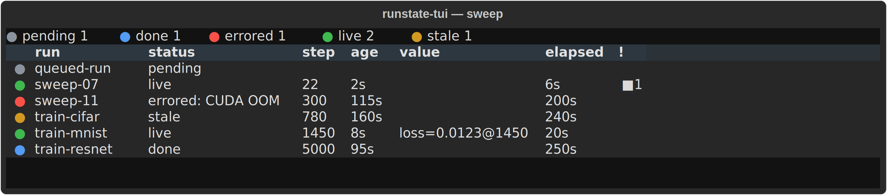
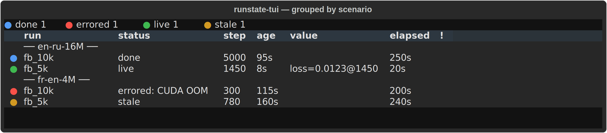
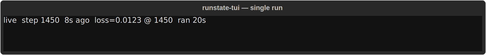
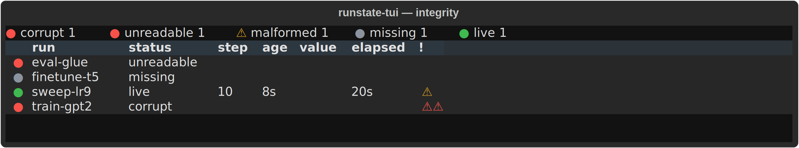
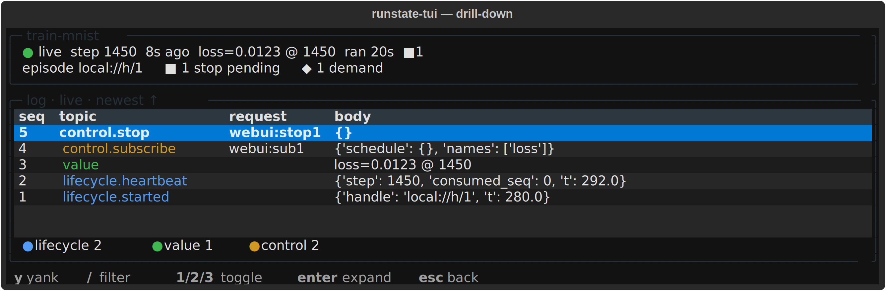
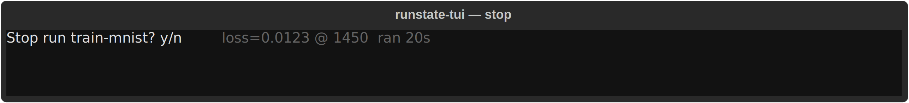

# runstate-tui

A terminal **cockpit** for [runstate](https://github.com/GeoffChurch/runstate) runs: see what's
happening across a whole sweep at a glance, drill into any one run, and **act on it** — stop a run
and watch the stop discharge. It reads a cold log directly — **no daemon, no server, no
instrumentation** — because the log already holds everything it shows.

It's focused on run *state* rather than metric dashboards (heavy plotting stays wandb / MLflow /
TensorBoard's job) — though a lightweight in-terminal value trend is a natural fit and is
[on the roadmap](docs/backlog/value-trend.md).

## Screens

The multi-run table — the whole sweep at a glance, a `●` traffic-light per run:



The same runs, sectioned by a manifest attribute (`--group-by scenario`):



A single run, focused:



The integrity taxonomy — a bad run is a loud row, never a crash:



The drill-down — episodes, undischarged stops, live demand, raw envelope tail:



The confirm-gated stop, so `s` never fires by accident:



## Install & run

It's a [uv](https://docs.astral.sh/uv/) project; `uv run` resolves everything from the lockfile on
first use. The console entry point is `runstate-tui`.

```bash
git clone https://github.com/GeoffChurch/runstate-tui && cd runstate-tui
uv run runstate-tui <target>
```

## Usage

Point it at whatever you have — it picks the right view from the shape of the target:

| Target | What you get |
|---|---|
| `runstate-tui run.db` | one run, focused (single-run view) |
| `runstate-tui runs/` | every `*.db` under a directory, recursively — live (glob) |
| `runstate-tui exp.json` | the runs listed in a manifest, each carrying attributes |
| `runstate-tui a.db b.db …` | an explicit set of runs |

Add `--group-by <attr>` to section the table by a manifest attribute (e.g.
`runstate-tui exp.json --group-by scenario`). Grouping needs attributes, so it applies to a
manifest (or any multi-run target), not a single run.

## Keys

| Key | Action |
|---|---|
| `enter` | drill into the selected run |
| `esc` | back out of the drill-down |
| `s` | stop the selected run (confirm-gated) |
| `/` | filter the envelope log |
| `1` `2` `3` | toggle lifecycle / value / control channels in the log |
| `y` | yank (copy) the selected envelope |
| `ctrl+q` | quit |

## Where to go deeper

- **Design & philosophy** — why it's shaped this way (the public-API-only rule, the categorical
  spine, the integrity taxonomy, the scale constraints): [`docs/design.md`](docs/design.md).
- **Roadmap** — deferred features and their committed seams: [`docs/backlog/`](docs/backlog/index.md).

## Depends on

[runstate](https://github.com/GeoffChurch/runstate) — the public observables it folds:
`peek_terminal`, `progress`, `last_activity`, `live_episode`, `latest_episode`, `live_demand`,
`undischarged_stops`, `value_series`, plus `attach_channel` / `create_channel` and `Watcher`.
